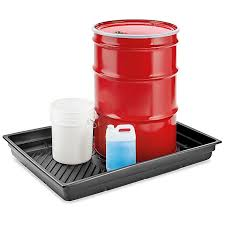
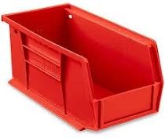
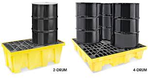
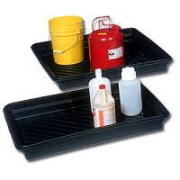
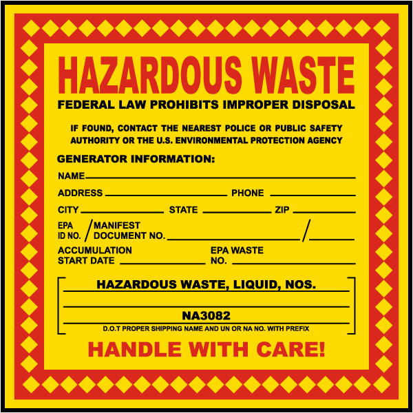
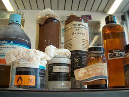

# 12. Waste Disposal

### Why Is Waste Disposal Important?

Waste generation, storage, and disposal should be given consideration in every experiment because a good amount of the waste from laboratory experiments is hazardous. Be aware of the laws that regulate waste disposal. Included here is an overview of the disposal of hazardous, biological, and other common types of waste generated in community biology labs.

## Waste Regulation

### Legal Duty of Care

Waste regulations vary by country and often by state or local jurisdiction. For example, the EU and the UK&#39;s Environmental Protection Acts includes a &quot;Duty of Care&quot; for all persons involved in the handling of waste, including producers.

In such cases waste producers must take reasonable and appropriate measures to ensure that:

- Waste is only stored, treated, deposited or disposed of in accordance with a waste management licence or other authorization.
- Waste does not escape from the control of the holder (Chain of Custody).
- Waste is only transferred to authorized persons such as registered waste carriers or licensed operators permitted to accept that type of waste.
- All transfers and movements of the waste are accompanied by an adequate written description of the waste, which will allow waste to be identified and subsequently handled correctly (Chain of Custody).

The duty begins with the person who generates the waste, and it cannot be delegated to others. This duty is legally enforceable. Violations can lead to criminal prosecution of individuals and community labs.

While the regulations differ across jurisdictions, the &quot;duty of care&quot; principles are international best practice. Consequently, community lab members must make every effort to categorize, segregate, and contain waste according to standards imposed by these practices and in accordance with the current legislation in their location.

### Other Waste Regulations

In the U.S., waste disposal is regulated by the EPA and state and local governments. Hazardous waste disposal information can be found [here](https://www.epa.gov/hw/learn-basics-hazardous-waste) and in the [EPA handbook on Hazardous Waste Hazardous Generator Regulations](https://www.epa.gov/sites/production/files/2014-12/documents/tool2012_0.pdf). Check your local waste regulations to further understand your responsibility as a waste generator.

Many regulations for pollution control have strict management and documentation procedures. These requirements can only be met by following procedures to segregate hazardous wastes from the greater bulk of less harmful materials. Mixing hazardous wastes should be avoided at all times.

Waste must be properly described and appropriate handling precautions noted. The description must be sufficient to ensure that subsequent holders of the waste are able to avoid mishandling it. The description should contain information about the source of the waste, what it is made up of, how it is produced, and details of any special problems which may be encountered by handling the waste. Waste containers must be correctly labeled, robust, and chemically resistant.

### Waste Hierarchy

The UK government&#39;s waste hierarchy is a useful framework to encourage minimization of waste and good recycling practices. This hierarchy is designed as follows:

- Reduce the amount of waste produced
- Re-use the material where possible
- Recycle the material where possible
- Recover any component parts or materials
- Dispose as the last resort

Due to the chemical and biological contamination of waste emerging from labs, extra attention should be paid to the first step in the hierarchy: reducing the amount of waste produced in the first place through good planning and procurement practices.

## Waste Management

The minimization and disposal of waste has become one of the most significant environmental issues in lab practice. The disposal of waste can have a significant impact on the environment, especially as the total volume of available landfill is decreasing. By ensuring effective waste management, the community lab will:

- Ensure compliance with all current environmental legislation
- Reduce the costs associated with waste disposal
- Enhance the reputation of the community lab
- Reduce the amount of material sent to landfill by adopting the reduce, re-use, recover, and recycle ethos
- Improve the working environment for community lab members
- Reduce the environmental, health, and safety risks to which lab members and visitors are exposed

All waste must be labeled as hazardous waste. The composition of the waste must be clearly noted with a label or on the side of the container, appropriate for its storage. Waste can be stored in a Satellite Accumulation Area (SAA) until the disposal date as allowed by local regulations. An SAA is an area away from the main work location where a larger amount of waste can be stored. In some countries waste needs to be disposed of regularly once accumulation starts. In other countries, the waste can accumulate until the container is full. Check local laws for more information.

There can be some restrictions on the type and size of the container for storage (e.g., it must be suitable for the type and composition of the wastes). Hazardous waste containers must be stored in a secondary containment, capable of holding the contents of the primary container in the event of a leak or spill. Ensure that all waste containers are labeled with their waste composition along with the owner&#39;s name when applicable.

 

 

**Figure.** Examples of Secondary Containment Bins.

Example of a Hazardous Waste Label.

### Waste Management Best Practices in a Community Lab

- Community labs should aim to minimize their environmental impact as much as possible. Each laboratory member must dispose of biological and chemical waste safely, and recycle glass, plastic and recyclable metals and devices whenever possible.
- In encouraging learning and collaboration within scientific and engineering projects, each community lab member should execute carefully planned projects with minimal environmental impact.
- Community labs must comply fully with environmental legislation and approved best management practices, and make continued efforts to minimize waste and pollution and to operate effective waste management procedures.
- Every member of the community lab must be trained in correct disposal of different types of waste before they start projects in order to minimize danger to themselves, other members, and volunteers and the environment.
- Lab managers should consider providing an email to answer questions about policy and waste disposal practices.
- Create a process for the laboratory members to determine, document, and setup waste streams for biological or chemical waste generated in an experiment.
- Provide clear signage about where to dispose of waste around the lab.
- Conduct risk assessments of projects for safety concerns, especially those involving hazardous chemicals. Make this mandatory for membership and required when their research changes scope or they require a hazardous chemical for the experiment (review the [BioCurious project disclosure form](https://docs.google.com/forms/d/1m6DPgDGgW-tf0cOm2QgBujZyIWTvIAuQTZgm0FZtQjc/edit?usp=drive_web)).
- Determine the owners of any chemicals and label containers with the owner&#39;s name.

### Recycling

Community labs should designate recycling containers and collection routes for plastic, glass, aluminium, batteries, paper, and cardboard. Be sure to identify and use nearby, local collection points and arrange for the regular removal of accumulated recyclable waste. New community lab members should be provided recycling guidelines as part of their induction process.

Some glass and plastic containers can be recycled. Do not recycle bottles that held a hazardous chemical. For containers that held non-hazardous chemicals, these can be washed and recycled, but be sure to fully remove their labels.

### Waste Incidents

Anyone involved in an incident concerning waste handling or disposal should document the incident and provide the information to leadership of the community lab. This information is needed to ensure that the details of the incident are recorded including what was spilled, how it was dealt with, if anyone was injured, and if any resources need replacing (incident report form examples from [Genspace](https://docs.google.com/document/d/17spZyvrnOUTjhvRu1T0Boib4EvmaSVXCGK6mYKV1MPA/edit?usp=sharing) and [FEMA](https://training.fema.gov/EMIWeb/IS/ICSResource/assets/ICS%20Forms//ICS%20Form%20209,%20Incident%20Status%20Summary%20(v3).pdf)). Waste management incident records should be reviewed by community lab members in an effort to improve training and onboarding procedures for new members.

Figure. Incompatible waste? Chemicals stored together.

(Photo credit: scheidegger0 on pixabay.com)

## Waste Classification

### Definition of Waste

In the UK, the legal definition of waste is &quot;any substance or object which the producer or the person in possession of it discards or intends or is required to discard.&quot; Within the terms of this definition, the producer is anyone whose activities produce waste or who carries out pre-processing, mixing, or other operations resulting in a change in its nature or composition.

### Controlled Waste

Controlled waste applies to waste from households, commerce, or industry, excluding waste from agricultural premises, waste from mines and quarries, explosives, and radioactive waste. Therefore, the majority of waste from community labs is classified as controlled waste.

### Biological Waste

All biological waste (GM and non-GM) should be inactivated by autoclaving or immersion in an appropriate disinfectant (e.g., 1% Virkon, 10% bleach) before leaving the community lab. Or a specialist waste disposal company should be contracted to collect the biological waste. See [Working with Microbes](https://docs.google.com/document/d/12gavZZEyT3en6gdKVRByraGLoqybI4nn_zp8g3iSB4w/edit#heading=h.rgnt67nndic8) and this [primer on disinfection](http://www.cfsph.iastate.edu/Disinfection/Assets/Disinfection101.pdf) for more information on deactivating microorganisms. Many community biology labs contract with a local medical waste disposal company for their biological waste.

Autoclave waste should be collected within the laboratory in clear autoclave bags, separate from general waste. Waste which has been inactivated by autoclaving and is not contaminated with hazardous chemicals should then be disposed of according to local regulations. In many places, this can enter the standard landfill stream as non-hazardous waste, but always check local regulations for guidance.

Click [here](https://youtu.be/rM_JTgLSKXk) or [here](https://youtu.be/T901F2W7wks) for a training video on autoclaves.

While self-treating wastes is one option for labs that only have small amounts, this might also require some additional regulation on the method. While localities allow waste to be autoclaved and disposed of, in some areas autoclaves must be properly certified and regularly verified using a spore test such as using the [ATTEST spore test from 3M](https://www.3m.com/3M/en_US/company-us/all-3m-products/~/All-3M-Products/Health-Care/Medical/Attest/?N=5002385+8707795+8707798+8711017+8711714+3294857497&amp;rt=r3). (More information on autoclaving practices and how to test and verify an autoclave from the CDC [here](https://www.cdc.gov/infectioncontrol/guidelines/disinfection/sterilization/sterilizing-practices.html).)

In the U.S., some biological waste is considered &quot;regulated medical waste,&quot; and the [definitions vary by state](http://www.hercenter.org/rmw/rmwtypes.php). In some areas, regulated medical waste and waste from recombinant DNA experiments must be disposed of using a certified waste hauler for final decontamination and disposal. While this service can be expensive and only serve commercial locations or urban areas, it can be an alternative when waste volumes increase. Please be aware that many of these have restrictive contracts and can be multi-year agreements with financial penalties so approach any contract with caution.

Some examples of medical waste haulers include (these are not endorsements but for general information):

**U.S. Based**

- [Stericycle](https://www.stericycle.com/)
- [Barnett Medical](https://www.bmswaste.com/)
- [Citiwaste](http://citiwaste.com/)

**UK Based**

- [Waste Care](http://www.wastecare.co.uk/recycling-collection/clinical-waste-disposal-management/)
- [Cannon Hygiene](https://www.cannonhygiene.com/services/clinical-medical-dental/clinical-waste)

### Clinical Waste

Clinical waste includes the disposal of any waste which consists of or is contaminated with human or animal tissue, blood, or other bodily fluids or secretions, drugs or other pharmaceutical products, swabs or dressings, syringes, needles, or other sharp instruments. This includes any other waste arising from medical, nursing, dental, veterinary, pharmaceutical or similar practice, investigation, treatment, care, teaching, research, or blood transfusion.

Most community labs are rated for Biosafety Level One (BSL-1) containment. Refer to [Biological Safety](https://docs.google.com/document/d/1DSWb9wwbvD1NAk0J06eCeqga5SHmuCkdpAMwJMxiLbk/edit#heading=h.o5m4y9nt1dkx) for more information. In general, at BSL-1, there should be no procedures that produce clinical waste. However, from time to time, projects are approved in community labs that involve animal cell culture, use of non-insect animal tissues, use of human cheek cells, or saliva samples that have risks of transmitting human pathogens. These should be inactivated prior to disposal. Follow the procedures outlined above for biological waste.

### Hazardous Waste

Put simply, a hazardous waste is a material with properties that make it dangerous or capable of harming humans or the environment if not properly managed. Making the determination of whether a waste is hazardous is complicated and requires an extensive understanding of the waste constituents, how it was generated, the material&#39;s chemical and physical characteristics, and the applicable regulations.

Chemical waste (including out of date chemicals, any chemicals withdrawn from use, unwanted materials, etc.) must be disposed of properly. Chemical wastes should be identified with the name of the chemical(s) being disposed, the approximate quantity, and a reference to the Safety Data Sheet. A suitable and certified provider to dispose of chemical waste must be identified for the laboratory.

Hazardous wastes also vary by country. In the UK, items classified as hazardous waste include CRT monitors and fluorescent light tubes. This type of waste includes the disposal of any substances classified, marked, or known to be explosive, oxidising, flammable, toxic, harmful, irritant, corrosive, dangerous to the environment, a poison, or classified as carcinogenic, mutagenic, teratogenic, or ecotoxic. Guidance on whether a waste should be classified as hazardous can initially be found at: [http://www.environment- agency.gov.uk/subjects/waste/](http://www.environment-agency.gov.uk/subjects/waste/).

In the U.S., the regulatory requirements for determining whether a waste is a hazardous waste are made by answering the following questions:

- Is the material excluded from the definition of solid or hazardous waste?
- Is the material exempted from regulation?
- Is the waste listed as a hazardous waste in the United States Environmental Protection Agency (US EPA) regulations?
- Does the waste exhibit one or more of the four hazardous characteristics: ignitability, corrosivity, reactivity, or toxicity?
- Is the material a [state-regulated waste](http://www.retailcrc.org/RegGuidance/rcracompliance/Pages/default.aspx)?

A material is considered to be a hazardous waste if it appears on the U.S. EPA [list of hazardous wastes](https://www.epa.gov/hw/defining-hazardous-waste-listed-characteristic-and-mixed-radiological-wastes) or exhibits a hazardous characteristic. Two methods can be used to determine if the waste exhibits hazardous characteristics: testing or applying generator knowledge.

- Testing must be done following strict regulatory protocols established by the U.S. EPA.
- [Generator knowledge](https://www.epa.gov/hwgenerators/frequent-questions-about-implementing-hazardous-waste-generator-improvements-final-rule#determinations) involves applying an understanding of the hazardous nature or characteristics of the waste based on the materials or processes used to generate the waste.

You can find more information about the disposal of waste in the UK by visiting the following website: [https://www.gov.uk/dispose-hazardous-waste](https://www.gov.uk/dispose-hazardous-waste); or by finding a local waste disposal agent in the EU: [http://www.hazardouswasteeurope.eu/members/](http://www.hazardouswasteeurope.eu/members/).

#### Very Small Quantity Generators (VSQG) Programs (U.S.)

In the U.S., many cities and towns will accept hazardous waste for disposal. In order for your lab to dispose of your waste this way. you may be classified as a Very Small Quantity Generator (VSQG). Very Small Quantity Generators (VSQGs) generate less than 100 kilograms per month of hazardous waste or less than one kilogram per month of acutely hazardous waste. The VSQG program may help small businesses deal with hazardous waste. Check with your local city, state, or country for more specific guidance.

To apply for the U.S. EPA VSQG program, follow these steps. They are easy, fast, inexpensive, and can help prevent expensive fines.

1. Apply for a local EPA permit.
2. Describe the hazardous waste you will be generating.
3. Make an appointment for dropping off your waste.
4. Head to the appointment with your paperwork, pay the fee, (most are drive in style so you don&#39;t even need to get out of your car).
5. Keep the paperwork for audits in the future.

_For information on the EPA VSGQ program or Small Quantity Generators_ [_click here_](https://www.epa.gov/hwgenerators/categories-hazardous-waste-generators)_. More helpful information can be found_ [_here_](https://www.epa.gov/sites/production/files/2014-12/documents/k01005.pdf) and [_State Regulations_](https://www.epa.gov/hwgenerators/where-hazardous-waste-generator-improvements-rule-effect#state) _and_ [_here._](http://www.retailcrc.org/RegGuidance/rcracompliance/Pages/default.aspx)

While VSQG is a terrific program, it is not the solution for everyone or for certain acutely toxic chemicals. Prior to using a chemical or starting an experiment that will generate waste, we suggest investigating the disposal requirements and costs; or use a different chemical or method to achieve similar results.

Many cities hold regular waste disposal events to collect household hazardous waste. Consider utilizing this service for one-off disposal needs.

## Pouring Waste Down the Drain

Drain disposal regulations vary by locality or municipality and effluent can be monitored by local authorities. As inexperienced individuals may be present in the lab, post a list of key substances that should not be disposed of into the drains including:

- Biological waste (e.g., non-GM organisms that might damage the plumbing)
- Live GM organisms (e.g., transformed/transfected cells, transgenic organisms, or genome-edited organism)
- Clinical waste
- Concentrated or stock chemical waste (local regulations and Safety Data Sheets should be consulted for guidelines on storage and disposal of chemicals. In general assume that chemicals, even dilute chemicals, cannot be put down the sink until you have checked)
- Dry ice (unlike wet ice this should _never_ be placed into drains as it can damage pipework)
- Sharps and broken glass—dispose of in designated sharps bins
- Molten or solid agar
- Antibiotic stocks or media with antibiotics
- Drug or other pharmaceuticals (including plant hormones)

## Common Waste Beyond Chemicals

### Batteries

Many batteries are classified as hazardous waste. This is because they contain corrosive materials such as sulphuric acid or potassium hydroxide, as well as heavy metals such as cadmium and lead. Some can be explosive under certain conditions. Community labs should determine the best location to recycle or dispose of batteries.

Some possible routes for recycling these include:

- Household hazardous waste programs
- Battery recycling programs for Li, lead acid
- Some local city/state agencies will collect batteries (i.e., fire departments, universities, recycling centers, etc.)
- Place of sale often have battery recycling programs

### Aluminum Cans

Drink cans made from aluminum or other recyclable metals should be disposed of in designated recycling bins. Drinks cans should not be taken into community labs.

### Cardboard

Community labs acquire many cardboard boxes every week. Thus, they should develop procedures to reuse and recycle cardboard and paper as much as possible. A recycling bin should be identified for the lab.

### Electrical/Electronic Equipment (E-waste)

Surplus electrical and electronic equipment may be donated to community labs. When disposal is necessary (e.g., the equipment is broken or unwanted), the equipment should be:

- Collected separately from other waste
- Decontaminated if necessary
- Passed to a suitable recycling contractor
- Treated and disposed in an environmentally sound way

Some localities have instituted regulations which require proper disposal and could result in a fine if not followed. Many localities have added E-waste collection services. Check with you local waste hauler and waste recycler for more information.

Whenever possible, all data and licensed software should be removed prior to collection. Any reusable equipment is refurbished and remarketed by the contractor. Any unusable equipment should be disassembled for recovery of component materials (e.g., metals, glass, and plastic). All other electrical and electronic waste should be decontaminated prior to collection.

### Fluorescent Tubes

Fluorescent tubes, spent ultraviolet (UV) tubes, and mercury and sodium lamps are classified as hazardous waste. Broken or faulty lamps and tubes must be collected and disposed of according to local regulations. Many household hazardous waste programs specifically deal with these bulbs and have recycling programs. In addition many retailers that sell these products offer recycling.

### Glass

Recycling bins for glass can be provided in the community lab. However, many glass products and bottles used in the lab cannot be recycled. For example, window glass, tumblers, and Pyrex glassware are unable to be recycled and should not be placed in recycling bins. Depending on the chemical or biological contents, the glass may need to go directly to hazardous/biological waste instead of recycling. Check with the safety data sheet associated with the glass container and your safety officer for more information.

Other glass products will need to be cleaned prior to recycling. Where bottles have contained highly flammable solvents (flash point less than 21°C), any remaining solvent must be disposed of as hazardous chemical waste. The bottle(s) should then be rinsed out with acetone (acetone washings must be disposed of as hazardous chemical waste) and washed out with water. Fill the bottle(s) to the brim with water (to drive out vapour), and empty the bottle in the sink. Invert the bottle (neck downwards) on a drying rack in a well-ventilated area until it is dry and any remaining vapours have vented. Deface the label and place the bottle either in a glass-recycling bin or in the general trash bin.

Broken glass is a special category of waste which might be chemically or biologically contaminated. Broken glass should be treated as [sharps](#_baq9z9dx3b3j) with a special disposal container depending on contamination. These sharps containers may be considered hazardous waste.

### Sharps

All sharps should be placed into a &quot;sharps container.&quot; Sharps should be disposed of as clinical and biological waste. However, if the needles have been used to purely transfer chemicals within a laboratory environment and have not come into contact with biological agents, they should be considered chemical waste. However, they should still be placed into sharps containers after use.

Glass microscope slides and coverslips and broken or used glass pipettes should be placed in designated contaminated glass or sharps bins in the community lab and should not be recycled. Medical waste service providers, described above, often offer pickup of sharps bins for disposal.

### Paper

Paper waste should be sorted into appropriate recycling collection bins in the community lab. These bins should be emptied at least weekly or sooner if full. Be aware that paper and cardboard can present a fire hazard. Do not allow the overfilling of bins, as this increases the risk of fire as well as becoming a handing issue due to its weight. Confidential waste paper should be disposed via shredding or through a local disposal company.

### Plastic

Plastics should be collected along with other recycling and be disposed in appropriate recycling bins (depending on the availability of recycling facilities in your location). If recycling plastic is an option, be aware that only types 1, 2 and 3 plastics are commonly recycled:

- Type 1: PET (Polyethylene Terephthalate) Soft drink and water bottles.
- Type 2: PE-HD (High-Density Polyethylene) Milk bottles, juice bottles, shampoo bottles, chemical and detergent bottles, buckets and rigid detergent bottles.
- Type 3: PVC-U (Unplasticised Polyvinyl Chloride) Cosmetic containers and mineral water bottles.

The number identifying the type of plastic can normally be found on the base of the item.

Please be aware that the plastic wafers and racks that come with disposable pipettes can be recycled in some areas. The tip and wafers are ground down into polypropylene pellets and used again.

### Refrigerators

Depending on your local/national laws, the refrigerant in your cooling systems (refrigerators) may need to be collected before disposal.

In the UK, the Ozone Depleting Substances Regulation 2037/2000 requires the removal of CFCs and HCFCs from the insulation foam as well as from the cooling circuit. This requirement also applies to industrial, commercial, and domestic appliances.

Also, in the UK, redundant fridges are now classified as hazardous waste and must not be disposed of unless the refrigerant has been removed from the cooling system and the insulation foam. A contractor should be consulted to dispose of these items. Similar legislation applies to the U.S. and other locations. Check with your local laws and waste haulers for more information.

### Toner and Ink Cartridges

Toner and ink cartridges should be recycled. Contact the cartridge manufacturer for recycling instructions; often charities collect these to sell for income.

### Miscellaneous Laboratory and Office Furniture

Where possible, surplus furniture should be sold or donated to another user (once decontaminated if necessary).

### Radioactive Waste

In general, most community labs will not approve experiments using radioactivity, and therefore radioactive reagents and equipment should not be brought on to the premises. Radioactive waste management involves dealing safely with the long-lived wastes from processes involving radioactivity. All radioactive uses are highly regulated to protect both human health and the environment. An example of specific governmental guidelines for radiation are available [here](https://www.gov.uk/government/collections/radioactive-substances-regulation-for-non-nuclear-sites).

### Asbestos

Asbestos is a mineral fiber that occurs in rock and soil. It&#39;s carcinogenic and in many countries classified as a hazardous waste subject to specific regulations. Because of its fiber strength and heat resistance, asbestos has been used in a variety of building construction materials for insulation and as a fire retardant. It has also been used in a wide range of manufactured goods, mostly in building materials (roofing shingles, ceiling and floor tiles, paper products, and asbestos cement products), friction products (automobile clutch, brake, and transmission parts), heat-resistant fabrics, packaging, gaskets, and coatings.

Fibers may be released into the air by the disturbance of asbestos-containing material during product use, demolition work, building or home maintenance, repair, and remodeling. In general, exposure may occur only when the asbestos-containing material is disturbed or damaged in some way to release particles and fibers into the air.

Asbestos is very difficult to dispose of and requires training, special removal methods, and PPE. If you suspect that your lab has asbestos that needs to be removed, you should not attempt to remove and dispose of it yourself. Most cities have asbestos abatement programs that will test and remove it for a fee. Contact your appropriate city or jurisdiction for more guidance on waste treatment options.