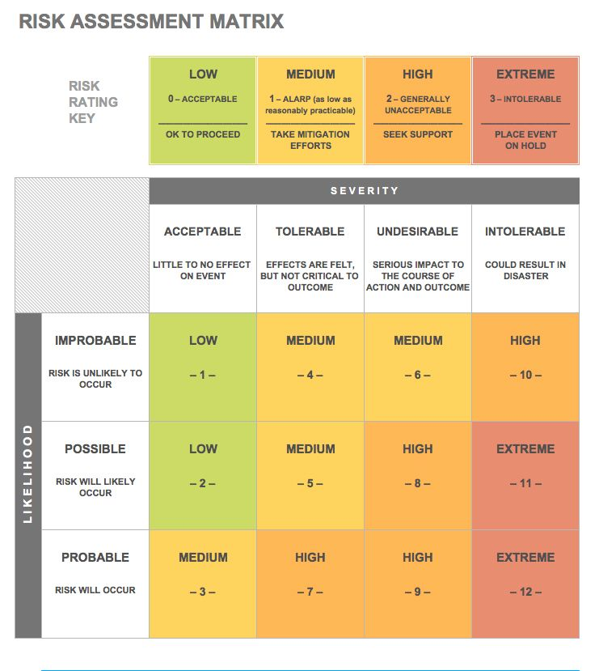
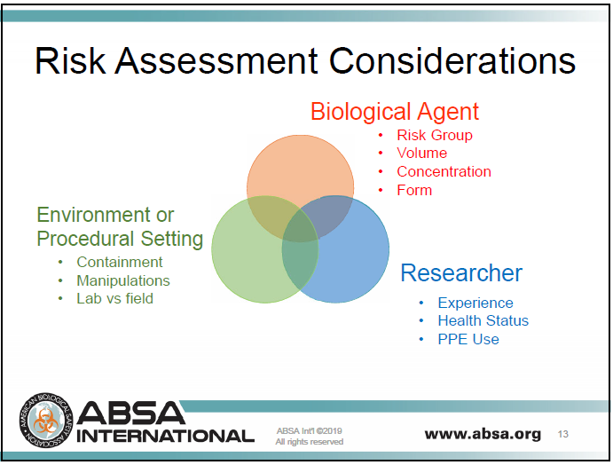

# 6. Biological Risk Assessments for Community Laboratories

## **Conducting a Risk Assessment**

&quot; **If you have one person doing your risk assessment, you have one risk opinion.&quot;**

Working with biological and chemical materials and specialty equipment has inherent risks. In general terms, risk is the probability of an adverse effect occurring as a result of a consequence (i.e., an exposure to a hazard such as heat, a corrosive chemical, or a biological organism).

Risk = P x C

_P = Probability of an event occurring (Probability addresses factors that affect_

_whether or not the exposure event occur)_

_C = Consequence of the event (Consequence addresses factors that affect the_

_severity of the exposure event)_

According to the [United Kingdom&#39;s Health and Safety Executive](https://www.aber.ac.uk/en/media/departmental/healthsafetyenvironment/riskassessment/indg163(v2).pdf), &quot;A risk assessment is simply a careful examination of what, in your work, could cause harm to people, so that you can weigh up whether you have taken enough precautions or should do more to prevent harm.&quot; Harm to the environment and the organization may also need to be taken into account.

Said another way, a risk assessmentis a method to identify and mitigate uncertainty to an _acceptable_ level. Sometimes the acceptable level of risk is laid out in regulation, but most often it is subjective and different people and organizations will have different levels of tolerance for the same risk.

A biological risk assessment(in contrast to a general risk assessment) is the process of identifying the hazardous characteristics associated with a biological material or system (e.g., viruses, bacteria, DNA, or mixtures) that could result in harm or adversely impact the environment. It considers the biological materials or systems and ascertains appropriate risk mitigation measures. For example, if an individual is using a pathogenic agent in the community space, an exposure could result in an infection or illness. Requiring unnecessary safeguards could be burdensome and expensive for the lab with little safety benefit. A biological risk assessment should be performed to help select appropriate containment facilities and equipment, safety devices, and other controls to help protect individuals working in the space.

While many people tend to err on the side of caution, a risk assessment requires thoughtful consideration. Determining acceptable risk is a subjective process to help define whether a risk is high or low, and ultimately whether it&#39;s acceptable or not.

A risk assessment matrix, as shown below in Figure 1, demonstrates the probability or likelihood of an event occurring along with its severity. The risk assessor must make value judgements about what is acceptable, tolerable, undesirable, or extreme. Once this assessment is made, it is useful to determine which protective measures are most effective proportional to the risk.

**Figure 1.** Risk assessment matrix from [U3115299](https://commons.wikimedia.org/w/index.php?title=User:U3115299&amp;action=edit&amp;redlink=1) on Wikimedia Commons, licensed under CC BY-SA 4.0.

## Risk Assessment Strategy

The European Union&#39;s Scientific Committee on Health and Environmental Risks has developed a[risk assessment process](https://ec.europa.eu/health/scientific_committees/emerging/docs/scenihr_o_048.pdf) for contained use (usually meaning use within a laboratory) of genetically modified organisms, which may be useful for community biolabs. It relies on four steps which are explained in more detail in the sections below:

1. Identification of biological hazards (i.e., any harm that could be caused to health or the environment by the biological materials being used).
2. Determination of the risk group of the Genetically Modified Organism (GMO) being used. This indicates the likelihood of it causing disease in healthy humans.
3. Consideration of the consequences of exposure to and release of the organism being used.
4. Classification of the overall risk of the activity.

### Step 1 - Identification of Biological Hazards

The first step of the risk assessment process is to understand the materials being used in the experiment. It is important to know if the biological materials pose a hazard to humans, animals, or the environment. In order to assess risk, it is necessary to ask several questions, including:

- Will an exposure to an agent cause an infection or disease?
- Will a release of the material potentially cause harm?
- Will the DNA modifications being made increase infectivity or allow it to compete in the environment?
- What are the characteristics of the GMO or pathogen being used, which may cause adverse effects to human or animal health or the environment?

Note: If working with microorganisms, the CDC/NIH manual, [Biosafety in Microbiological and Biomedical Laboratories](https://www.cdc.gov/labs/BMBL.html), and the NIH&#39;s [Guidelines for Research Involving Recombinant or Synthetic Nucleic Acid Molecules](https://osp.od.nih.gov/biotechnology/nih-guidelines/) provide a starting point for determining the hazards associated with the common pathogenic agents.

The risk assessment of the contained use activities involving pathogens and of activities involving GMOs should be carried out on a case-by-case basis (meaning that it depends on the GMO or pathogen concerned, the introduced genes, and the intended use) while being based on established science (i.e., known scientific facts, results published in recognized scientific journals).

### Step 2 - Determination of the Risk Group

The risk assessment should be based on the Risk Group (RG) of the agents being used, if known (see Table 1). Agents are classified into four RGs according to their relative pathogenicity for healthy adult humans. Please be aware that most GMOs have not been assigned a risk group.

**Table 1. Basis for the Classification of Biohazardous Agents by Risk Group (RG)**

| **Risk Group 1 (RG1)** | Agents that are not associated with disease in healthy adult humans |
| --- | --- |
| **Risk Group 2 (RG2)** | Agents that are associated with human disease which is rarely serious and for which preventive or therapeutic interventions are _often_ available |
| **Risk Group 3 (RG3)** | Agents that are associated with serious or lethal human disease for which preventive or therapeutic interventions _may be_ available (high individual risk but low community risk) |
| **Risk Group 4 (RG4)** | Agents that are likely to cause serious or lethal human disease for which preventive or therapeutic interventions are _not usually_ available (high individual risk and high community risk) |

The most critical properties inherent to the biological material that should be considered for a risk assessment include:

- Severity of disease or infection
- Infectivity (virulence of the organism, infective dose, mode of transmission, natural route of infection)
- Host range of the microorganism and spectrum of specificity of target species
- Biological stability
- Potential of survival and dissemination in the community or the environment
- Availability and effectiveness of prophylactic or therapeutic measures (such as vaccination or antisera, antibiotics, chemotherapeutic agents, taking into consideration the possibility of the emergence of resistant strains)

The classification of the biological risk of plant pathogens includes three additional criteria including:

- Prevalence of the microorganism in the environment
- Presence of target species around the installation or the site of waste disposal
- Exotic characteristics of the microorganism

For genetically modified microorganisms, each part or element used for the genetic modification should be evaluated as well as the following:

- Recipient microorganism
- Genetic material inserted (originating from the donor organism), function/activity, gain of use, whole operons, [mobilized vector elements](https://cmr.asm.org/content/31/4/e00088-17), location of insertion
- Vector, expression system, antibiotic resistance, selection mechanism, viral proteins
- Donor microorganism or organism
- Resulting microorganisms (note that genetically engineered probiotic bacteria pose an underappreciated risk, since they can be passed person-to-person more readily than other RG-1 lab strains)

### Step 3 - Consideration of the Outcomes from Exposure to and Release of Potential Biological Materials

When considering the type of activity in terms of probability of exposure to potential biological materials, not only should risk factors inherent to the biological material be considered, factors associated with the type of operations and modifications should be examined as well. This includes:

- Potential for aerosol generation
- Scale of the activity
- Concentration and volume (e.g., cultures, supernatants)
- Type of work proposed (e.g., in vitro,in vivo, challenge studies, work with lab animals, non-standardised manipulations)

Below is a graphic from [ABSA International](https://absa.org/) with an overview of considerations when conducting a risk assessment. Be sure to account for a lab member&#39;s experience and health status.

## 

**Figure 2.** Risk assessment considerations. Slide used with permission from [ABSA International](https://absa.org/).

### Step 4 - Assignment of a Class of Risk for the Contained Use Activity

The properties inherent to the recipient organism, the genetic material inserted, the vector and the resulting GMO, and the characteristics of the activity are then considered together in a final risk assessment, leading to the assignment of a class of risk of the contained use activity.

The class of risk of the activity defines the level of the recommended containment level. The class of risk of the activity may be equivalent to the class of risk of the microorganisms or it may be higher or lower. Each level of containment implies the set-up of technical requirements, specific equipment, work practices, and other protective measures.

- **Class 1:** Contained use of no or negligible risk for which containment level 1 is appropriate to protect human health and the environment.
- **Class 2:** Contained use of low risk for which containment level 2 is appropriate to protect human health and the environment.
- **Class 3:** Contained use of moderate risk for which containment level 3 is appropriate to protect human health and the environment.
- **Class 4:** Contained use of high risk for which containment level 4 is appropriate to protect human health and the environment.

It is also important to be aware that a risk assessment should always be carried out on a case-by-case basis and under normal condition and single fault condition.

## Sample Risk Assessment Forms

Community labs, such as Biomakespace, use a [risk assessment form](https://docs.google.com/document/d/1tlN4RccKxdLOih225oKfjHJIWneAz_LCAjdB6MslhuA/edit) which guides people through the various aspects of the risk assessment. Examples of completed risk assessments have been provided by biosafety agencies in the [UK](http://www.hse.gov.uk/biosafety/gmo/acgm/acgmcomp/part2.pdf) and [Belgium](https://www.biosafety.be/content/contained-use-biological-risk-assessment-sheets-practical-examples).

## Additional Resources

Below are some resources available to aid in the assessment of risk for the types of experiments being performed in community laboratories:

- [UK&#39;s Scientific Advisory Committee on Genetic Modification Risk Assessment for GM Microorganisms](http://www.hse.gov.uk/biosafety/gmo/acgm/acgmcomp/part2.pdf). Recommended for including specific information on routine cloning and expression work using _E. coli,_ hazards of genetic inserts, worked case studies, and example completed risk assessments.
- [SYNBERC - Traditional Biological Risk Assessment](https://www.youtube.com/watch?v=9s48kuPNr8U). Youtube training video covering Biosafety Level (BSL) categories, risk assessment, and dual-use concerns.

- [International Federation of Biosafety Associations and Sandia National Laboratories](http://www.aam.org.ar/descarga-archivos/Laboratory-Biosafety-Biosecurity-Guidance.pdf). Biosafety and Biosecurity Risk Assessment Technical Guidance Document.
- [US Association of Public Health Laboratories Risk Assessment Best Practices](https://www.aphl.org/programs/preparedness/Documents/APHL%20Risk%20Assessment%20Best%20Practices%20and%20Examples.pdf). Examples of actual risk assessments conducted by various agencies and labs.
- [Commission of the European Communities](http://www.hse.gov.uk/biosafety/gmo/acgm/ecrisk.htm). Guidance notes for risk assessment on the contained use of genetically modified microorganisms.
- [Belgian Biosafety.](https://www.biosafety.be/content/contained-use-gmos-andor-pathogens-tools-risk-assessment-and-risk-management)Tools for risk assessment and risk management of GMOs and/or pathogens, includes example risk assessments for a range of projects.
- [Biosafety in Microbiological and Biomedical Laboratories](https://www.cdc.gov/labs/BMBL.html). CDC/NIH&#39;s manual on BioSafety outlines general rules and regulations on safety. See Section II—Biological Risk Assessment.
- [Guidelines for Research Involving Recombinant or Synthetic Nucleic Acid Molecules](https://osp.od.nih.gov/wp-content/uploads/NIH_Guidelines.html#_Toc3457026). NIH Guidelines for researchers working with Recombinant organisms. See Section II-A. Risk Assessment.
- [Public Health Agency of Canada](http://www.canada.ca/en/public-health/services/laboratory-biosafety-biosecurity/pathogen-safety-data-sheets-risk-assessment/pathogen-risk-assessment-template.html). Pathogen Risk Assessment.
